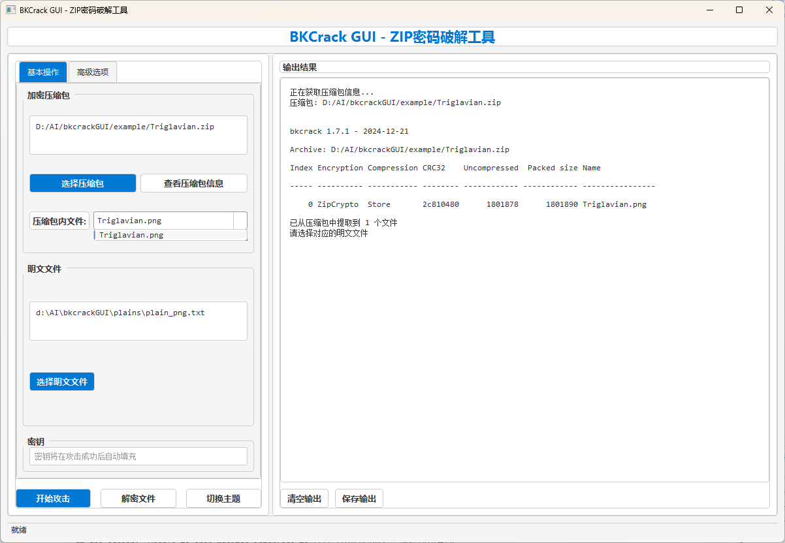
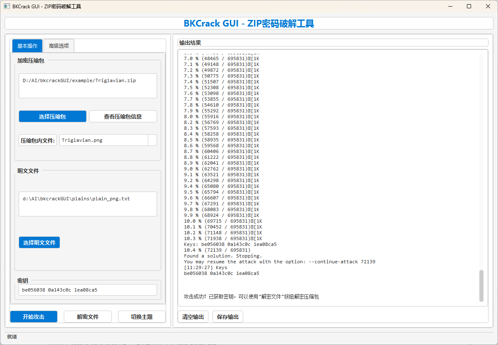

# BKCrack GUI

<a href="https://qm.qq.com/q/fZMW9VWoUg"></a>

BKCrack GUI 是一个基于 [bkcrack](https://github.com/kimci86/bkcrack) 的可视化ZIP压缩包明文攻击工具，提供了友好的图形界面，让ZIP文件密码破解变得简单易用。

## 功能特点

- **现代化界面**：采用PySide6开发的美观界面，支持亮色和暗色主题切换
- **自动化流程**：自动从压缩包提取文件名，并匹配合适的明文文件
- **多种攻击选项**：
  - 基本明文攻击：通过已知明文内容破解ZIP密码
  - 暴力破解：使用指定字符集和密码长度范围进行暴力破解
  - 密码恢复：从已知密钥恢复原始密码
- **高级选项**：支持设置偏移量、截断大小、多线程等参数
- **操作便捷**：一键执行攻击、解密和导出无密码压缩包

## 安装说明

1. 克隆或下载本仓库
2. 安装依赖包：
```shell
pip install -r requirements.txt
```
3. 运行程序：
```shell
python run.py
```

## 使用方法

### 1. 查看压缩包信息

1. 点击"选择压缩包"按钮，选择需要破解的ZIP文件
2. 点击"查看压缩包信息"按钮，程序会自动提取压缩包中的文件名
3. 文件名会自动显示在下拉框中供选择



### 2. 明文攻击

1. 从下拉框中选择要攻击的文件名
2. 点击"选择明文文件"按钮，选择对应的明文文件（程序会自动尝试匹配合适的明文）
3. 可以根据需要设置高级选项（偏移量、截断大小等）
4. 点击"开始攻击"按钮执行攻击
5. 攻击成功后，密钥会自动填入密钥输入框


### 3. 导出无密码压缩包

1. 确认密钥已正确填入（攻击成功后会自动填入）
2. 点击"选择输出文件"按钮，设置解密后的压缩包保存位置
3. 点击"解密文件"按钮，程序会生成一个无密码的压缩包



### 4. 高级功能

- **暴力破解**：在获取密钥后，可以使用暴力破解选项卡尝试恢复原始密码
- **密码恢复**：使用已知密钥，通过指定字符集和最大长度，恢复可能的原始密码
- **主题切换**：点击界面右上角的主题按钮，可以在亮色和暗色主题之间切换

## 示例文件

项目中包含了示例压缩包和明文文件，可以用于测试和学习：
- 示例压缩包：`example/Triglavian.zip`
- 明文文件：`plains/plain_png.txt` 和 `plains/plain_svg.txt`

## 注意事项

- 明文攻击需要确保明文文件内容与压缩包中对应文件的内容完全一致
- 攻击过程可能需要一定时间，取决于文件大小和计算机性能
- 如果攻击失败，可以尝试调整偏移量或使用不同的明文文件

## 致谢

- [bkcrack](https://github.com/kimci86/bkcrack) - 提供核心的ZIP密码破解功能
- [PySide6](https://wiki.qt.io/Qt_for_Python) - 提供现代化的GUI框架
- [BKCrack GUI](https://github.com/JasmineAura/bkcrackGUI) - 提供现代化的GUI框架