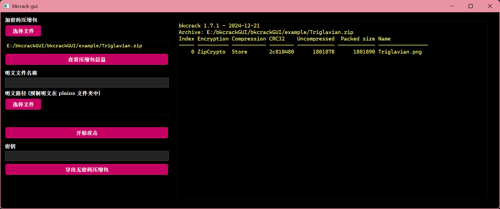
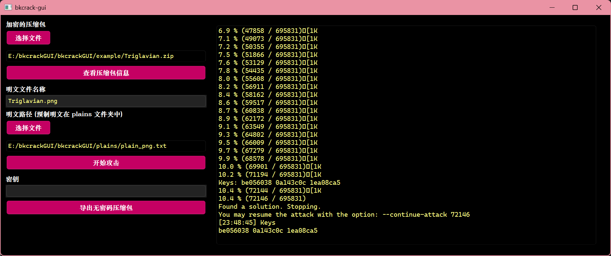
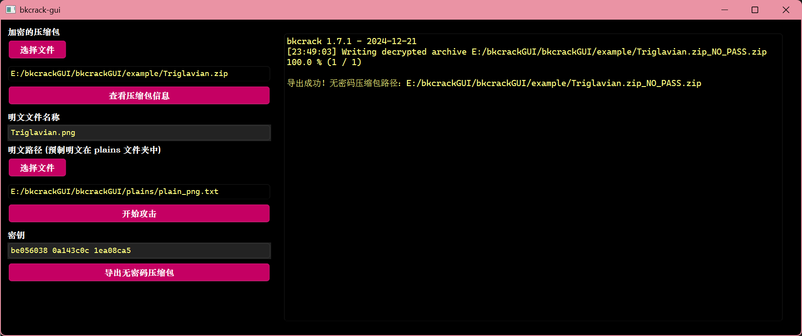

# bkcrackGUI

基于 bkcrack 的可视化压缩包明文攻击工具。

区别于 [bkcrack](https://github.com/kimci86/bkcrack/tree/master)，bkcrackGUI 提供了更便捷的操作方式。

## 运行
安装依赖
```shell
pip install -r requirements.txt
```
启动程序
```shell
python main.py
```
## 如何使用
里面预制了一道题目，来自 ctfshow 的 [月饼杯misc2_洗寰瀛](https://ctf.show/challenges#misc2_%E6%B4%97%E5%AF%B0%E7%80%9B-496)。
### 查看压缩包信息
导入压缩包，然后点击 “查看压缩包信息”。


### 明文攻击
填写明文文件名称，然后选择明文，这里预制了 png 和 svg 的明文，存放在 plains 目录中。

设置好后点击 “开始攻击” 即可，需要等待一定时间。


### 导出无密码压缩包
明文攻击如果成功，会输出一段密钥，将其填入 “密钥” 一栏即可，注意不要删掉指定的明文文件。设置好后点击 “导出无密码压缩包” 即可，会存放在和加密的压缩包的相同目录下。


